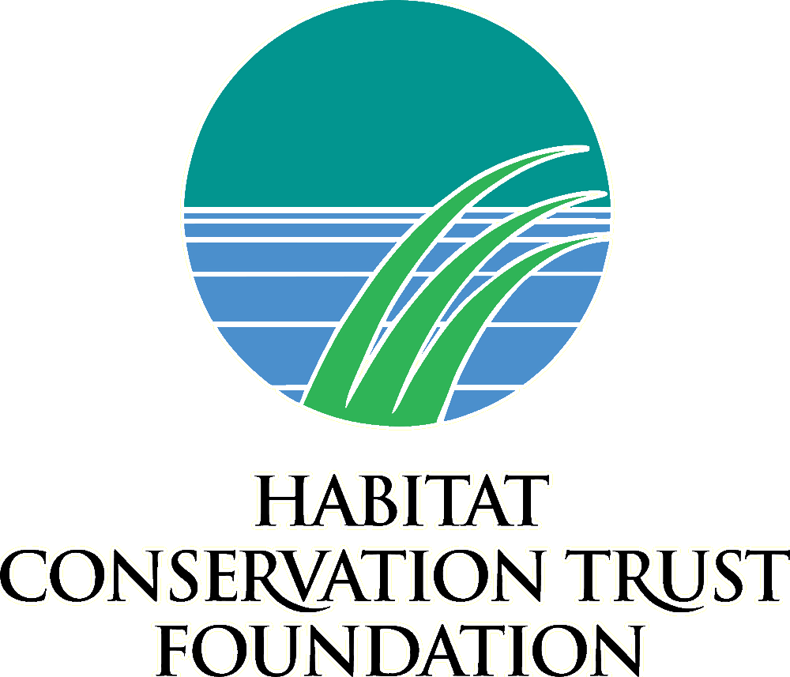

<!-- README.md is generated from README.Rmd. Please edit that file -->

Kootenay Lake Exploitation Analysis
===================================

`klexr` is the companion R analysis package for Thorley et al.'s manuscript The Fishing and Natural Mortality of Large Piscivorous Bull Trout and Rainbow Trout in Kootenay Lake, British Columbia (2008-2014).

Installation
------------

To use the `klexr` package first install [R](http://cran.r-project.org) (version 3.2.2 or greater) and [JAGS](http://mcmc-jags.sourceforge.net) (version 4.0.1 or greater).

Then execute the following code at the R terminal:

    #install.packages("devtools")
    devtools::install_github(paste("poissonconsulting", sep = "/", c(
      "tulip@v0.0.13", "datalist@v0.5.0", "juggler@v0.1.5", "jaggernaut@v2.3.1",
      "klexdatr", "lexr")))
    library(klexr)

Usage
-----

To quickly replicate the results with *unreliable* model estimates use:

    replicate_results()

This option is useful for testing everything is installed correctly.

To replicate the results with **reliable** model estimates use:

    replicate_results("report")

Information
-----------

For more information type `?replicate_results` after loading the package.

Acknowledgements
----------------

The project was primarily funded by the Habitat Conservation Trust Foundation.

The Habitat Conservation Trust Foundation was created by an act of the legislature to preserve, restore and enhance key areas of habitat for fish and wildlife throughout British Columbia. Anglers, hunters, trappers and guides contribute to the projects of the Foundation through licence surcharges. Tax deductible donations to assist in the work of the Foundation are also welcomed.
